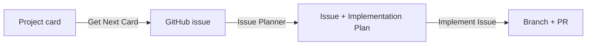

# Copilot Instructions — simulator-mcp-servers

Sim RaceCenter's open source MCP servers for racing simulators. Rust Cargo workspace
(`crates/mcp-core`, `crates/iracing-mcp`, `crates/launcher`, future `crates/lmu-mcp`); developed in a
Linux dev container, cross-compiled to `x86_64-pc-windows-gnu` for the shipped artifact.

## Where things live

- **Architectural decisions:** `docs/adr/`. Start at the index, [docs/adr/README.md](../docs/adr/README.md),
  which links every ADR (e.g. [docs/adr/0001-project-layout.md](../docs/adr/0001-project-layout.md)).
  Consult the relevant ADR before proposing changes to workspace shape, the launcher's process
  model, or a simulator adapter's public contract — and add/update an ADR when a decision like that
  is made, not just the code.
- **Contribution & workflow docs:** [README.md](../README.md), [CONTRIBUTING.md](../CONTRIBUTING.md)
  (DCO sign-off, coding standards, PR process), [CODE_OF_CONDUCT.md](../CODE_OF_CONDUCT.md),
  [SECURITY.md](../SECURITY.md).
- **Planned/open work:** product/planning captures design and feature-development work as cards on
  the [project board](https://github.com/orgs/simracecenter/projects/1), cross-linked from each
  ADR's "Open follow-ups" section. Actual engineering work is tracked separately as **GitHub
  issues** — the artifact PRs reference and close. The two are not interchangeable: a project card
  can exist without an issue (it's still just planning/design), but writing code always requires an
  issue per [CONTRIBUTING.md](../CONTRIBUTING.md). A card and its issue should link back to each
  other once both exist.

## Custom agents (`.github/agents/`)

This repo defines specialized custom agents for recurring developer workflows — check this folder
before starting work that matches one of their purposes, rather than improvising the same multi-step
process from scratch.

Feature and bug work flows through three agents in sequence, each handing off to the next via
GitHub (a project card, then an issue, then a PR) rather than via conversation context:

- **Get Next Card** (`.github/agents/get-next-card.agent.md`) — refines a GitHub Project (v2) card
  into a recorded decision: picks the next actionable card (or a named one), explains it,
  interviews the engineer to resolve gaps, records the decision in the relevant ADR and the card
  itself, and opens a linked GitHub issue if the card requires implementation.
- **Issue Planner** (`.github/agents/issue-planner.agent.md`) — turns a GitHub issue into a
  concrete, file-by-file implementation plan: reads the issue, interviews the engineer to close
  gaps, validates that acceptance criteria are concrete and testable, and records the plan as an
  `## Implementation Plan` section on the issue. Writes no code.
- **Implement Issue** (`.github/agents/implement-issue.agent.md`) — executes an issue's recorded
  implementation plan: creates a dedicated branch, implements it, runs `fmt`/`clippy`/`test`,
  commits with DCO sign-off, pushes, and opens a PR referencing the issue. Expects a plan to
  already exist (via Issue Planner) — stops and asks for one if it's missing.

## Improving agents

When a task follows a repeatable shape (the same fetch → explain → interview → decide → record
pattern, or any other multi-step workflow done more than once the same way), treat that as a signal
to create a new custom agent under `.github/agents/` or refine an existing one — don't just repeat
the ad hoc steps silently each time. Propose this to the developer when you notice it.
