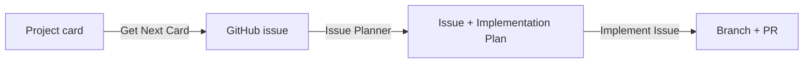

# AGENTS.md

Canonical instructions for any AI coding agent (GitHub Copilot, Codex, or otherwise) working in this
repository. Read the files linked below **before** making changes — don't guess at conventions this
repo has already documented.

Sim RaceCenter's open source MCP servers for racing simulators. Rust Cargo workspace
(`crates/mcp-core`, `crates/iracing-mcp`, `crates/launcher`, future `crates/lmu-mcp`); developed in a
Linux dev container, cross-compiled to `x86_64-pc-windows-gnu` for the shipped artifact.

## Start here

1. **[docs/adr/README.md](docs/adr/README.md)** — index of every Architecture Decision Record.
   Consult the relevant ADR (e.g. [docs/adr/0001-project-layout.md](docs/adr/0001-project-layout.md))
   before proposing changes to workspace shape, the launcher's process model, or a simulator
   adapter's public contract. Record a new ADR (or amend an existing one) when you make a decision
   like that, not just the code. In particular, read
   **[docs/adr/0003-single-active-simulator-constraint.md](docs/adr/0003-single-active-simulator-constraint.md)**
   before adding anything that smells like multi-server support (a handler registry, per-sim
   dynamic ports, merged capabilities across sims, etc.) — this repo only ever runs **one**
   simulator MCP server at a time, by hard design constraint, not as a v1 simplification.
2. **[CONTRIBUTING.md](CONTRIBUTING.md)** — ground rules (issue-before-code, DCO sign-off on every
   commit, SPDX headers on new source files), development environment/build commands, required
   pre-PR checks (`cargo fmt --all`, `cargo clippy --workspace --all-targets -- -D warnings`,
   `cargo test --workspace`), and coding standards.
3. **[CODE_OF_CONDUCT.md](CODE_OF_CONDUCT.md)** and **[SECURITY.md](SECURITY.md)** — how we treat
   each other, and how to report vulnerabilities (this project's MCP transports are unauthenticated
   by design; see SECURITY.md's trust model before touching transport code).
4. **[README.md](README.md)** — project overview and crate layout.

## Custom agent workflows

This repo defines specialized custom agents under **[.github/agents/](.github/agents/)** for
recurring developer workflows — check this folder before improvising a multi-step workflow that
already has a dedicated agent.

Feature and bug work flows through three agents in sequence, each handing off to the next via GitHub
(a project card, then an issue, then a PR) rather than via conversation context, so pick up the
workflow at whichever stage the work is already at:

- **Get Next Card** ([.github/agents/get-next-card.agent.md](.github/agents/get-next-card.agent.md))
  — refines a GitHub Project (v2) card into a recorded decision: picks the next actionable card (or
  a named one), explains it, interviews the engineer to resolve gaps, records the decision in the
  relevant ADR and the card itself, and opens a linked GitHub issue if the card requires
  implementation.
- **Issue Planner** ([.github/agents/issue-planner.agent.md](.github/agents/issue-planner.agent.md))
  — turns a GitHub issue into a concrete, file-by-file implementation plan: reads the issue,
  interviews the engineer to close gaps, validates that acceptance criteria are concrete and
  testable, and records the plan as an `## Implementation Plan` section on the issue. Writes no code.
- **Implement Issue** ([.github/agents/implement-issue.agent.md](.github/agents/implement-issue.agent.md))
  — executes an issue's recorded implementation plan: creates a dedicated branch, implements it,
  runs `fmt`/`clippy`/`test`, commits with DCO sign-off, pushes, and opens a PR referencing the
  issue. Expects a plan to already exist (via Issue Planner) — stops and asks for one if it's
  missing.

### Improving agents

When a task follows a repeatable shape (the same fetch → explain → interview → decide → record
pattern, or any other multi-step workflow done more than once the same way), treat that as a signal
to create a new custom agent under `.github/agents/` or refine an existing one — don't just repeat
the ad hoc steps silently each time. Propose this to the developer when you notice it.

## Planning vs. engineering

Product/planning work lives on the [project board](https://github.com/orgs/simracecenter/projects/1),
cross-linked from each ADR's "Open follow-ups" section; actual engineering work is tracked as
**GitHub issues**, which PRs reference and close. A project card can exist without an issue
(design-only), but writing code always requires an issue per CONTRIBUTING.md. Don't conflate the
two, and link a card and its issue back to each other once both exist.
